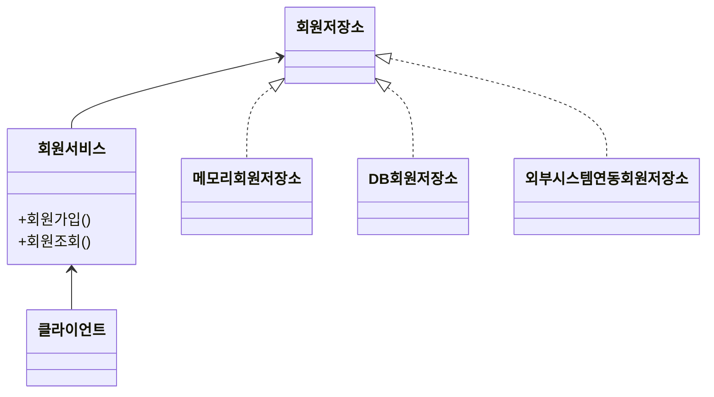
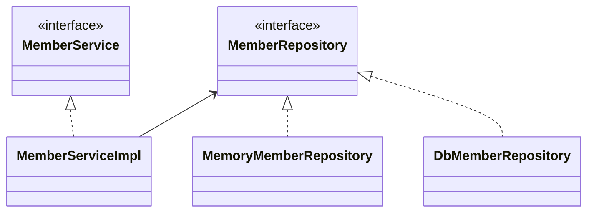
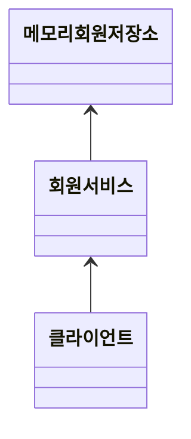

회원 도메인 설계
==============

### 회원 도메인 협력 관계 (기획자용)

```mermaid
classDiagram
    회원서비스 <-- 클라이언트
    회원저장소 <-- 회원서비스
    회원저장소 <|.. 메모리회원저장소
    회원저장소 <|.. DB회원저장소
    회원저장소 <|.. 외부시스템연동회원저장소
    class 회원서비스 {
        +회원가입()
        +회원조회()
    }
```

### 회원 클래스 다이어그램 (개발자용)

```mermaid
classDiagram
    MemberService <|.. MemberServiceImpl
    MemberRepository <-- MemberServiceImpl
    MemberRepository <|.. MemoryMemberRepository
    MemberRepository <|.. DbMemberRepository
    class MemberService {
        <<interface>>
    }
    class MemberRepository {
        <<interface>>
    }
```

### 회원 객체 다이어그램

```mermaid
classDiagram
    회원서비스 <-- 클라이언트
    메모리회원저장소 <-- 회원서비스
```
