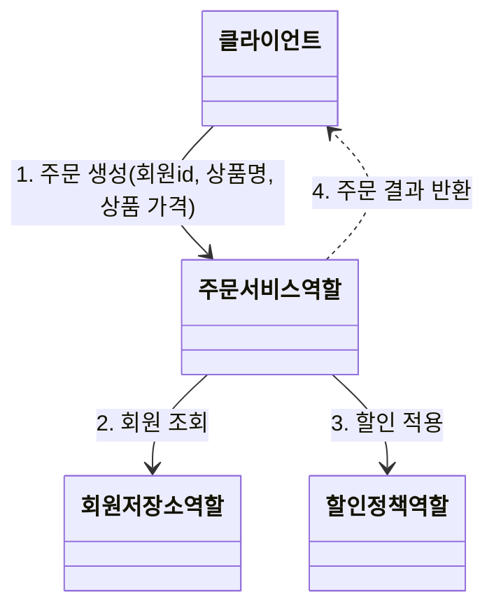
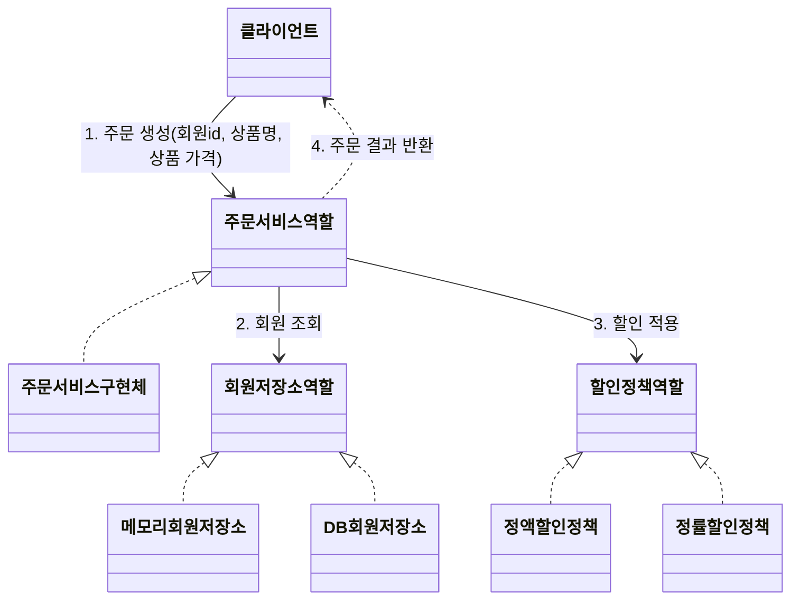
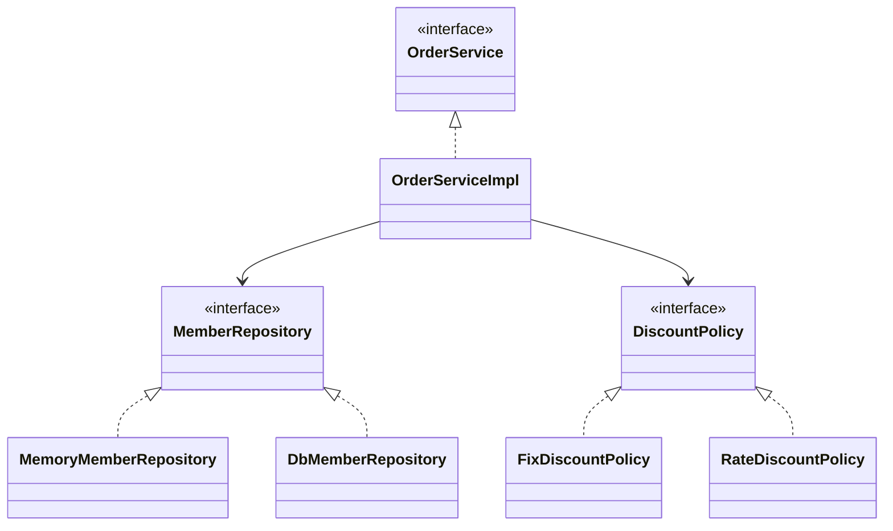

주문과 할인 도메인 설계
===================

### 주문 도메인 역할, 협력, 책임

1. 클라이언트는 주문 서비스에 주문 생성을 요청
2. 할인을 위해서는 회원 등급이 필요(e.g. VIP면 10%할인)
3. 주문 서비스는 회원 등급에 따른 할인 여부를 할인 정책에 위임
4. 할인 결과를 포함한 주문 결과 반환
* 실제로는 주문 데이터를 DB에 저장해야하지만, 이 프로젝트에선 생략하고 단순히 주문 결과를 반환

### 주문 도메인 전체

* 역할과 구현을 분리 - 자유롭게 구현 객체를 조립할 수 있다.

### 주문 도메인 클래스 다이어그램

