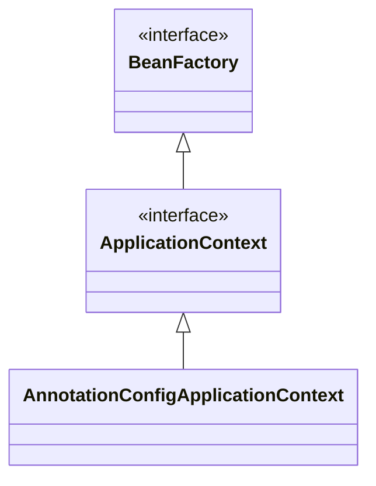

# BeanFactory와 ApplicatioContext

### BeanFactory
* 스프링 컨테이너의 최상위 인터페이스로, 스프링 빈을 관리하고 조회하는 역할 담당
* getBean() 제공
* 현재 테스트코드에 짜여져 있는건 대부분 BeanFactory 기능을 쓴 것.

### ApplicationContext
* BeanFactory + @(부가기능)
  * 따라서 BeanFactory는 직접 사용할 일이 거의 없음. 부가기능 포함된 이걸 씀.
  * 부가기능
    * 메시지소스를 활용한 국제화 기능 - 한국에서 들어오면 한국어로
    * 환경변수 - 로컬, 개발, 운영 구분 처리
    * 애플리케이션 이벤트 - 이벤트를 발행하고 구독하는 모델을 편리하게 지원
    * 편리한 리소스 조회 - 파일, 클래스패스, 외부 등에서 리소스를 편리하게 조회

### 스프링 컨테이너
* BeanFactory나 ApplicationContext(일반적으로)을 스프링 컨테이너라 함.
