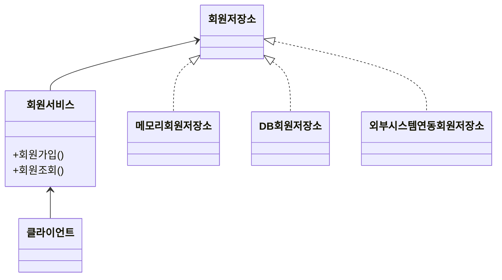
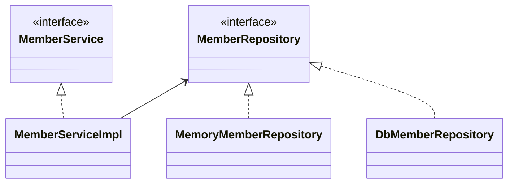
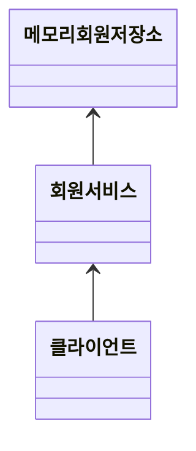

Requirements And Design
=======================
---

## Requirements

### 회원
* 회원을 가입하고 조회 가능
* 회원 등급 : 일반, VIP
* 회원 데이터는 DB 일수도 있고 외부 시스템일수도 있음 (미확정)

### 주문과 할인 정책
* 회원은 상품을 주문할 수 있음
* 회원 등급에 따라 할인 정책을 적용할 수 있음
* 할인 정책은 모든 VIP는 1000원 할인 - 고정 금액 할인 (차후 변경 가능)
* 할인 정책은 변경 가능성이 높음 (미확정)

즉, 회원 데이터, 할인 정책 등을 현재로썬 결정하기 어려운 상황임.

---
## 회원 도메인 설계

### 회원 도메인 협력 관계 (기획자용)

### 회원 클래스 다이어그램 (개발자용)

### 회원 객체 다이어그램

